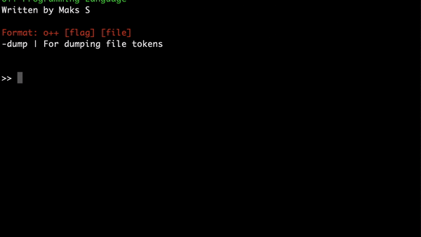

# O++ Programming Language



# Purpose
O++ is a small scritping language similar to Lua, which is great for small tasks and embedding in C. O++ is being worked on towards providing a friendy syntax while also providing max portability and efficiency. 

# Learn
Under the wiki tab I am providing pages of lessons about O++ features. This will be updated frequently as O++ features grow.

# Run / Compile
To compile O++ from source go to the Opp folder then to src and there will be a makefile. Otherwise I will provided compiled distributions of O++. [**O++ Download**](https://github.com/Encryptr/O-plus-plus/releases/tag/1.0.0)

# Using O++ Syntax
If you want to use my own custom made o++ syntax highlighting, I made an XML file under the XML folder that you can import to notepad++ to use O++ syntax and grammar.

# Examples
Examples in example folder!

```ruby
# Comment
print ("Hello World");
```
