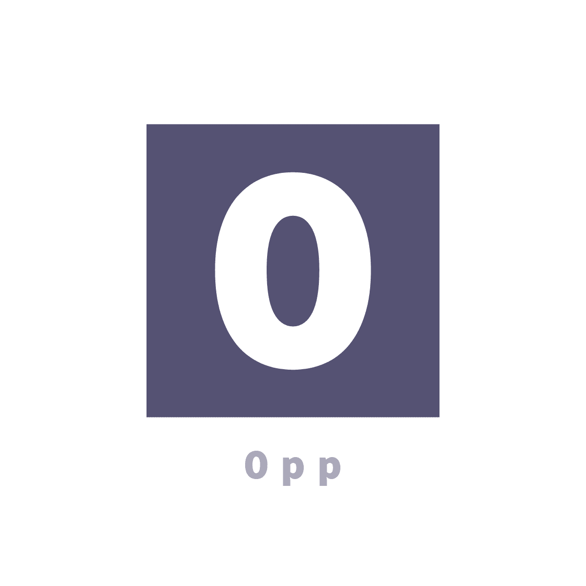

# Opp Programming Language
> Opp is a programming language / compiler inspired by the classic B programming language

Opp was created to be a simple but powerfull general purpose langauage. Opp was created alongside the idea that it is to be a standalone compiler that can run on windows / mac / linux. Bopp also takes inspiration from the old B programming language as well as C. In the end Bopp is made to educate and experimant with creating standalone compilers.



[![Contributors][contributors-shield]][contributors-url]
[![Forks][forks-shield]][forks-url]
[![Stargazers][stars-shield]][stars-url]
[![Issues][issues-shield]][issues-url]
[![License][license-shield]][license-url]

## Installation

OS X & Linux:

```sh
# Run the makefile
make
```

Windows:

```sh
# Make sure to have mingw
mingw32-make.exe 
```

## Usage example

Example of the bopp language can be found under the examples folder. Opp can be also learned in the [wiki][wiki]!

```c
main(argc, **argv) {
	println("Hello World!");
	return 0;
}
```

## Development

Currently Opp is a compiler aimed for linux x86-64 however opp will be able to compile to macos/win in the future. Opp main compile targets are going to be linux / mac and windows will be saved for last. Opp requires **ld** to link the generated obj file with opp's standart library alongside c's stdandart library. 

## Release History
* 0.0.1
    * Work in progress

## Meta

Distributed under the Apache-2.0 license. See ``LICENSE`` for more information.

[https://github.com/Encryptr/Bopp](https://github.com/Encryptr/)

## Contributing

1. Fork it (<https://github.com/Encryptr/O-plus-plus/fork>)
2. Create your feature branch (`git checkout -b feature/fooBar`)
3. Commit your changes (`git commit -am 'Add some fooBar'`)
4. Push to the branch (`git push origin feature/fooBar`)
5. Create a new Pull Request

<!-- Markdown link & img dfn's -->
[wiki]: https://github.com/Encryptr/O-plus-plus/wiki
[contributors-shield]: https://img.shields.io/github/contributors/Encryptr/O-plus-plus.svg?style=flat-square
[contributors-url]: https://github.com/Encryptr/O-plus-plus/graphs/contributors

[forks-shield]: https://img.shields.io/github/forks/Encryptr/O-plus-plus.svg?style=flat-square
[forks-url]: https://github.com/Encryptr/O-plus-plus/network/members

[stars-shield]: https://img.shields.io/github/stars/Encryptr/O-plus-plus.svg?style=flat-square
[stars-url]: https://github.com/Encryptr/O-plus-plus/stargazers

[issues-shield]: https://img.shields.io/github/issues/Encryptr/O-plus-plus.svg?style=flat-square
[issues-url]: https://github.com/Encryptr/O-plus-plus/issues

[license-shield]: https://img.shields.io/github/license/Encryptr/O-plus-plus.svg?style=flat-square
[license-url]: https://github.com/Encryptr/O-plus-plus/blob/master/LICENSE.txt


